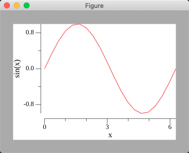

gplot - A Go+ drawing Engine with a syntax similar to matlab

========


[](https://goreportcard.com/report/github.com/go-wyvern/gplot)
[](https://github.com/goplus/gop)
[](https://pkg.go.dev/mod/github.com/go-wyvern/gplot)

## Tutorials

How to run gplot tutorials?

* Download Go+ and build it. See https://github.com/goplus/gop#how-to-build. (Depends on Go+ ver 1.1 or higher)
* Download gplot and build it.
  * git clone `git@github.com:go-wyvern/gplot.git`
  * cd gplot
  * go install -v ./...
* Build tutorials and run.
  * cd tutorial/xxx
  * gop run .

### tutorial/01-single-plot

 

Through this example you can learn how to simply draw a line graph.

Here are some codes in [index.plot](tutorial/01-single-plot/index.plot):

```go
x := linspace(0, 2*pi, 20)
y := [sin(x) for i <- x]
plot(x, y)
```

### tutorial/02-multi-plot


In this example, we can learn how to draw multiple lines into one figure.

Here are all the codes of [index.plot](tutorial/02-multi-plot/index.plot):

```go
x := linspace(0, 2*pi, 20)
y1 := [sin(x) for i <- x]
y2 := [cos(x) for i <- x]
plot(x, y1, x, y2)
```

### tutorial/03-label-plot



Through this example, we can learn how to add names to axis.

Here are some codes in [index.plot](tutorial/03-label-plot/index.plot):

```go
x := linspace(0, 2*pi, 20)
y := [sin(x) for i <- x]
xlabel("x")
ylabel("sin(x)")
plot(x, y)
```

### tutorial/04-subplot


Through this example, we can learn how to draw multiple axis into a figure.

Here are some codes in [index.plot](tutorial/04-subplot/index.plot):


```go
x := linspace(0, 2*pi, 20)
y1 := [sin(x) for i <- x]
y2 := [cos(x) for i <- x]
y3 := [x*x for i <- x]
y4 := [-1*x*x for i <- x]
subplot(2,2,1)
plot(x, y1)
subplot(2,2,2)
plot(x, y2)
subplot(2,2,3)
plot(x, y3)
subplot(2,2,4)
plot(x, y4)
```

### tutorial/05-legend


Through this example, we can learn how to add legend to the axis.

Here are some codes in [index.plot](tutorial/05-legend/index.plot):


```go
x := linspace(0, 2*pi, 20)
y1 := [sin(i) for i <- x]
y2 := [cos(i) for i <- x]
legend("sin(x)", "cos(x)")
plot(x, y1, x ,y2)
```

### tutorial/06-title


Through this example, we can learn how to add title to the axis.

Here are some codes in [index.plot](tutorial/06-title/index.plot):


```go
x := linspace(0, 2*pi, 20)
y := [sin(i) for i <- x]
title("this is title")
plot(x, y)
```

### tutorial/07-bar


Through this example, we can learn how to draw a bar

Here are some codes in [index.plot](tutorial/06-bar/index.plot):


```go
a := [1, 3, 5, 7, 11]
b := [1, 3, 5, 7, 11]
c := [1, 3, 5, 7, 11]
nominalX("a", "b", "c")
bar(a, b, c)
```
